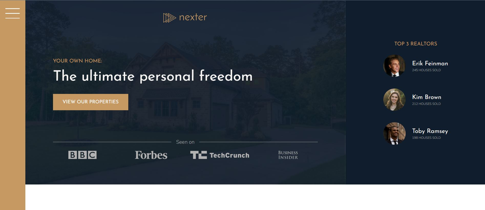
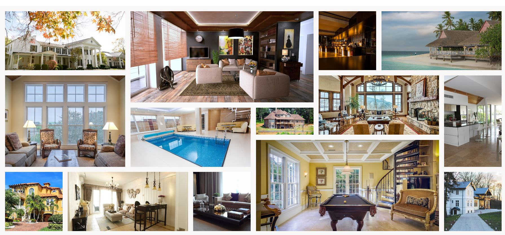
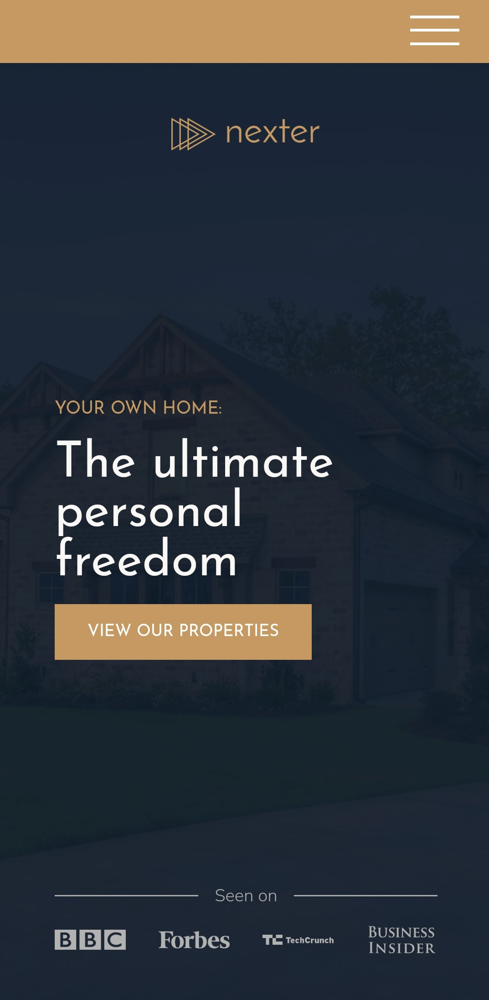
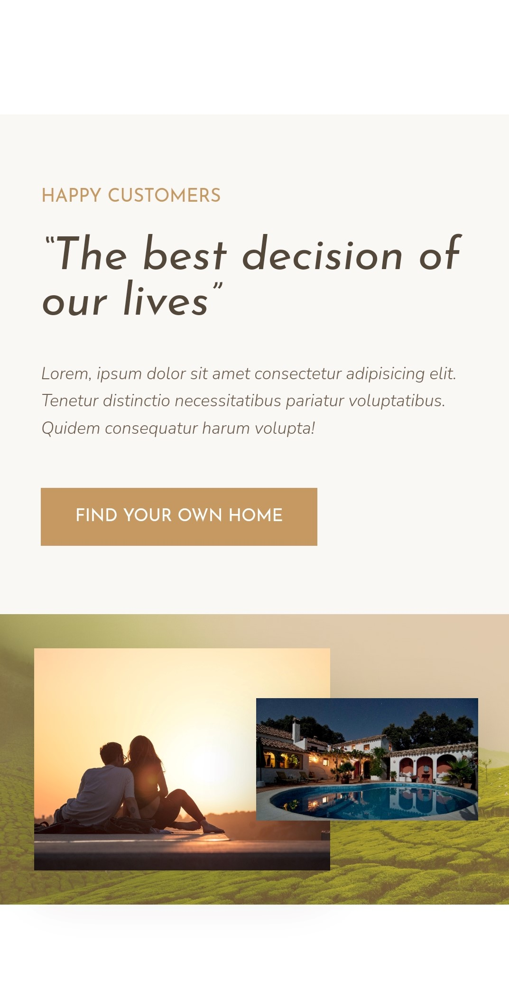
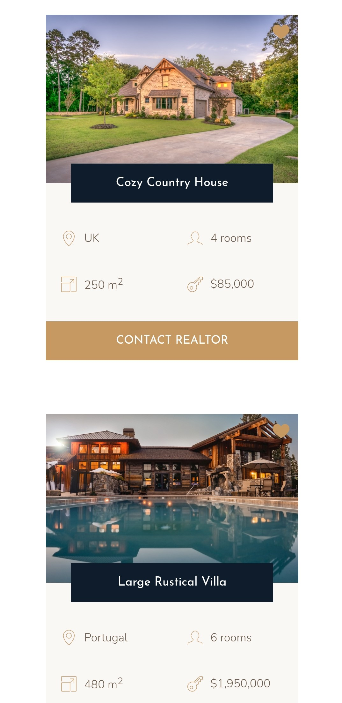

# Nexter Project

This project is about the realtors' company with luxury homes.
The main goal of this project is to use CSS grids as many as possible

This project was built with the author in an online course "Advanced CSS and Sass: Flexbox, Grid, Animations and More!" from Udemy.

## Table of contents

- [Overview](#overview)
  - [Screenshot](#screenshot)
  - [Links](#links)
- [My process](#my-process)
  - [Built with](#built-with)
  - [What I learned](#what-i-learned)
  - [Useful resources](#useful-resources)

## Overview

Users should be able to:

- View the optimal layout depending on their device's screen size
- See hover, active, and focus states for interactive elements on the page
- See really responsive design thanks to using CSS grid

### Screenshot

Header - desktop:



Gallery - desktop:



Header - mobile:



Stories section - mobile:



Homes' section - mobile:



### Links

- Live Site URL: [Live site from GIT](https://irina-dehtiarenko.github.io/Grid_ex-Nextel_project/)

## My process

### Built with

- Semantic HTML5 markup
- SASS(SCSS)
- Flexbox
- CSS Grid
- Desktop first principle
- NPM commands

### What I learned

I learned about:

- Building the main layout of the page using CSS grid, also building some smaller components using a grid with a flexbox

- some browsers support:

```scss
.feature {
  // I use the code below only for example, that I can do it in this way(when some browsers don't support  of CSS grid )
  // example:

  float: left;
  width: 33.3333%;
  margin-bottom: 6rem;

  @supports (display: grid) {
    width: auto;
    margin-bottom: 0;
  } // example
  //...
}
```

### Useful resources

- [Advanced CSS and Sass: Flexbox, Grid, Animations and More!](https://www.udemy.com/course/advanced-css-and-sass/) - This is the course during which I built this project, I also learned a lot of useful things. The author explains everything very thoroughly, very deeply explaining complicated things.
